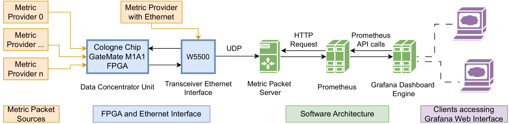
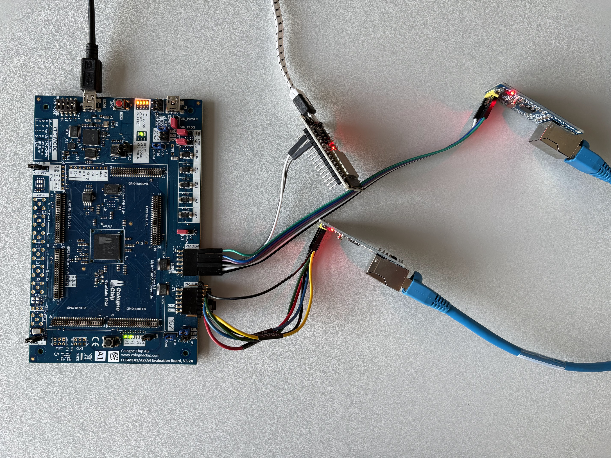
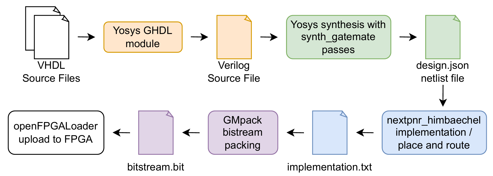

# FPGA-centric Slow Control Interlock System (SCIS)

This Project aims to build a Slow Control Interlock System, based on a Data Concentrator implemented on a Cologne Chip GateMate M1A1 FPGA and utilizing the W5500 Ethernet platform.

## Infrastructure overview


## Metric Packet Sources

Currently Metric Packets start with a protocol code (V01), contain a device identifier and end with metric value (Q22.10 signed fixed point).
These packets can stem from various Metric Providers / data acquisition systems (DAQ) and are forwarded to the GateMate M1A1 FPGA.
By using the W5500 Ethernet platform, Metric Packets can arrive over Ethernet as UDP packets and be forwarded to the Data Concentrator implemented on GateMate FPGA fabric.

## GateMate FPGA platform



The GateMate M1A1 Evaluation Board V3.2 was used with two SPI W5500 Ethernet modules and using one ESP32 for testing external interlock assertion.

Bitstream was uploaded onto the 64Mb SPI flash memory (SPI-MODE: quad) for fast FPGA reconfiguration.

### VHDL workflow

This repository contains the VHDL source files, constraints and a makefile to build the project for the CologneChip GateMate M1A1 FPGA Board.

Tools within the OSS-CAD-Suite by YoysyHQ (tested with Build 21-01-2026) have been used for synthesis, implementation, bitstream packing and bitstream uploading.



Building the data concentrator project for two W5500s connected to the PMOD pins:
```bash
make all
```

Test W5500 functionality:

```bash
make w5500_all
```

GHDL + GTKwave simulations:

```bash
make sim_spimaster
make sim_w5500
make sim_dc
make sim_all
```

### Slow Control Software Architecture

The Software architecture consists of a Metric Packet Server, Prometheus and Grafana

Source Code, testing and configuration files are found in /software_infrastructure

Prometheus 3.6.0 was used an run using a config yaml found in /software_infrastructure/Prometheus:
```bash
./prometheus --config.file=prometheus.yaml
```
Grafana 12 was configured to run as a docker container with a persistent volume and with exposed HTTP port 3000.
Prometheus was added to Grafana as a data source.

## Data Concentrator


Features: 
- 8-bit data AXI-stream based data flow
- Low latency deterministic interlock assertion in the Threshold Logic Units
- Glitch filter with hysteresis behavior for external interlock signals
- 8 priority levels (encoded in 3 bit USER field)
- sending an "INTERLOCK" or "ALMOSTFULL" alert by the Telemetry Sender


Adding new devices to the Threshold Lookup Memory can be done using the threshold_address_generator.py script.

## Current Project State

Working:
- W5500 controller (UDP) with round robin through all 8 sockets
- W5500 controller "send_first" and "receive_first" default routines
- Highest priority first readout from Priority FIFOs in Metric Packet Manager
- Implements at 40 MHz FPGA sys_clk speed
- Dual W5500, one for RX and one for TX
- Protocol Code V01 (signed Q22.10 values)
- Data concentrator with UDP packet adapter, Metric Packet Manager and first version of interlock protocol code V01 Metric Packets

ToDo/Bug:
- RX W5500 sometimes closes socket, when bombarded with UDP packets that exceed the 2KB RX Buffer

Backlog : 
- W5500 Controller for TCP packets (strips the UDP Packet Header from tdata on AXI-stream data transmission)
